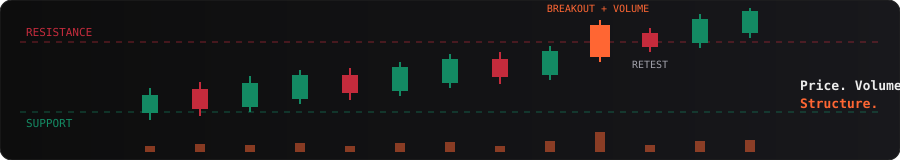
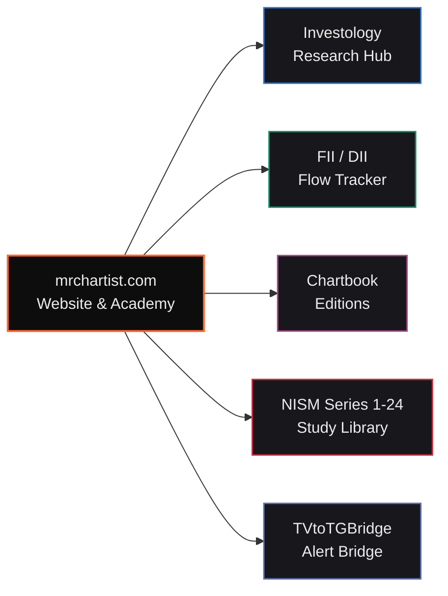

  

  

  

    

  
  
  
  
  

    

  

  <h3>India's Premier Financial Literacy &amp; Quantitative Research Platform</h3>
  <em>Bridging retail trading with institutional-grade research, price action analysis, and options mechanics.</em>

 

  

 

## 👋 About Rohit Singh (Mr. Chartist)

<table>
<tr>
<td width="50%" valign="top">

**Credentials**

- SEBI Registered Research Analyst — **INH000015297**
- B.Com — Financial Market Management
- **30+ NISM & NCFM** certifications (Series 1 to 24)
- Amazon **#1 Bestselling Author** — *Trading Candlestick Patterns*

</td>
<td width="50%" valign="top">

**Focus**

- Price & Volume Analysis
- Options Mechanics
- Quantitative Systems
- **14+ years** in markets · trusted by **1.5 Lakh+** traders & investors

</td>
</tr>
</table>

> *"Price is the truth. Volume is the conviction. Everything else is noise."* — **Rohit Singh**

---

## 🧭 How I Read a Chart

Every analysis on [mrchartist.com](https://mrchartist.com) follows the same four-step price action discipline:

| Step | Question | What I look at |
|:---:|:---|:---|
| **1** | Where is price? | Trend, support and resistance zones |
| **2** | Who is in control? | Candlestick behaviour at key levels |
| **3** | Is there conviction? | Volume on breakout / breakdown candles |
| **4** | Is the move accepted? | Retest of the broken level, consolidation before the next leg |

No clutter. No guesswork. Only price, volume, and structure.

---

## 🏛️ The 9 Academy Learning Modules

Each learning pillar on [mrchartist.com](https://mrchartist.com) has its own colour identity and India-first examples.

| | Module | Colour | Key Coverage |
|:---:|:---|:---:|:---|
| 🚀 | **Start Your Journey** |  | Market fundamentals, NSE/BSE order matching, T+1 settlement, account setup & risk rules |
| 📊 | **Technical Analysis** |  | Price action principles, candlestick patterns, VWAP, support/resistance & market cycles |
| ⚡ | **Options & F&O** |  | Option Greeks (Delta, Gamma, Theta, Vega), spreads, Iron Condors, pay-off math & risk |
| 📈 | **Fundamental Analysis** |  | Balance sheet, P&L, cash flow, annual reports & valuation metrics |
| 🏢 | **Know Your Sector** |  | Banking & Financials, IT, Auto, Pharma, Sugar, Steel & FMCG deep dives |
| 🔎 | **Know Your Company** |  | Micro-cap and blue-chip case studies, governance & moat analysis |
| 📜 | **NISM Certifications** |  | Exam syllabus prep guides, NISM Series 1 to 24 |
| 🖥️ | **TradingView & Charting** |  | Pine Script, chart configuration, multi-timeframe layouts & setups |
| 🤖 | **Algo & Systematic Trading** |  | Backtesting, algorithmic execution, Python financial APIs & automated risk management |

---

## 📚 Featured Book

<table>
<tr>
<td width="620">

### **Trading Candlestick Patterns**
*Amazon #1 Bestseller*

A practical guide to reading candlestick patterns in real Indian market conditions.

- **250+ pages** of actionable content
- Real examples from **NSE, MCX and F&O**
- Available in **English & Gujarati**
- No theory fluff, only price action signals

</td>
</tr>
</table>

---

## 🌐 Product Ecosystem

| Status | Platform | What it does | Stack |
|:---:|:---|:---|:---|
|  | **[MrChartist.com](https://mrchartist.com)** | Courses, pre-rendered SEO guides and trading tools: the home of the Academy | React 18, Vite, TS |
|  | **[Investology](https://investology.mrchartist.com/)** | SEBI RA research, chartbooks and market analytics | Next.js, React |
|  | **[FII/DII Tracker](https://fii-diidata.mrchartist.com)** | Institutional cash and derivative flow tracking | React, Node.js |
|  | **[TVtoTGBridge](https://tvbridge.mrchartist.com/)** | TradingView alerts to Telegram / Discord / Slack | Node.js, Express |

<b>View ecosystem map</b>

 

---

## 🌟 Featured Open Source

&nbsp;

&nbsp;

---

## 💻 Tech Stack

 

---

## 📊 GitHub Activity

  
  

    

  

---

## 🤝 Connect

| Platform | Link |
|:---|:---|
| Website | [mrchartist.com](https://mrchartist.com) |
| Research | [investology.mrchartist.com](https://investology.mrchartist.com) |
| Instagram | [@rrohit_singh_lodhi](https://www.instagram.com/rrohit_singh_lodhi/) |
| LinkedIn | [Rohit Singh](https://www.linkedin.com/in/rohit-singh-192a291b6/) |

---

## ⚖️ SEBI Regulatory Compliance & Disclaimer

> [!IMPORTANT]
> **Registration Details**: **Rohit Singh** is a **SEBI Registered Research Analyst** with Registration No. **INH000015297**.
>
> **Disclaimer**: All content, code, articles, chartbooks, and educational modules provided on [mrchartist.com](https://mrchartist.com) and associated repositories are for **educational and informational purposes only**. Stock market investments are subject to market risks. Read all related documents carefully before investing. Past performance is not indicative of future returns.

---

  
  &nbsp;
  

    

  © Mr. Chartist. All rights reserved. • Built with passion for Indian Stock Markets 🇮🇳

