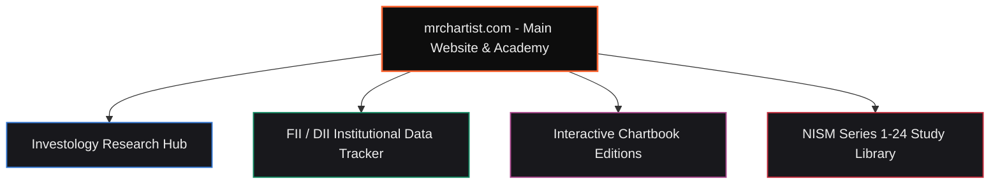

<div align="center">

  

  <br />
  <br />

  <a href="https://mrchartist.com"></a>
  <a href="https://mrchartist.com"></a>
  <a href="https://investology.mrchartist.com"></a>
  <a href="https://www.instagram.com/rrohit_singh_lodhi/"></a>
  <a href="https://www.linkedin.com/in/rohit-singh-192a291b6/"></a>

  <br/><br/>

  

  <br/>

  ### **India's Premier Financial Literacy & Quantitative Research Platform**
  *Bridging retail trading with institutional-grade research, price action analysis, and options mechanics.*

</div>

---

### 👋 About Rohit Singh (Mr. Chartist)

```txt
Rohit Singh | Mr. Chartist
SEBI-Registered Research Analyst | Reg. No. INH000015297

• B.Com - Financial Market Management
• 30+ NISM & NCFM Certifications (Series 1 through Series 24)
• Amazon #1 Bestselling Author - "Trading Candlestick Patterns"
• Specialist in Price & Volume Analysis, Options Mechanics & Quantitative Systems
• 14+ Years of Market Experience | Trusted by 1.5 Lakh+ Traders & Investors
```

> *"Price is the truth. Volume is the conviction. Everything else is noise."* — **Rohit Singh**

---

### 🏛️ The 9 Academy Learning Modules

Each learning pillar on [mrchartist.com](https://mrchartist.com) is built with dedicated color-coded visual design and structured India-first examples:

| Module Icon | Module Name | Theme Hex | Key Coverage |
|:---:|:---|:---:|:---|
| 🚀 | **Start Your Journey** | `#2E73CF` *(Sapphire)* | Stock market fundamentals, NSE/BSE order matching, T+1 settlement, accounts setup & risk rules |
| 📊 | **Technical Analysis** | `#A8458C` *(Plum)* | Price action principles, candlestick patterns, VWAP, support/resistance & market cycles |
| ⚡ | **Options & F&O** | `#E0632F` *(Sunset)* | Option Greeks (Delta, Gamma, Theta, Vega), spreads, Iron Condors, pay-off math & risk |
| 📈 | **Fundamental Analysis** | `#138A63` *(Emerald)* | Balance sheet analysis, P&L, cash flow statements, annual reports & valuation metrics |
| 🏢 | **Know Your Sector** | `#1F8597` *(Onyx Teal)* | Industry deep dives: Banking & Financials, IT, Auto, Pharma, Sugar, Steel & FMCG |
| 🔎 | **Know Your Company** | `#D11A6E` *(Magenta)* | Micro-cap & blue-chip fundamental case studies, corporate governance & moat analysis |
| 📜 | **NISM Certifications** | `#C42B3C` *(Crimson)* | Complete exam syllabus prep guides for NISM Series 1 through Series 24 |
| 📈 | **TradingView & Charting** | `#5E6FAC` *(Royal Navy)* | Pine Script coding, indicator configuration, multi-timeframe layouts & chart setups |
| 🤖 | **Algo & Systematic Trading**| `#A8801F` *(Gold)* | Quantitative backtesting, algorithmic execution, Python financial APIs & automated risk management |

---

### 📚 Featured Bestselling Book

<div align="center">

<table>
<tr>
<td width="600">

### **Trading Candlestick Patterns**
*Amazon #1 Bestseller*

A comprehensive, practical guide to mastering candlestick patterns in real Indian market conditions.

- **250+ pages** of practical, actionable content
- Real examples from **NSE, MCX, and F&O**
- Available in **English & Gujarati**
- Zero theory fluff — pure price-action signals

<br/>

<a href="https://mrchartist.com/trading-candlestick-patterns/">

</a>

</td>
</tr>
</table>

</div>

---

### 🌐 Product Ecosystem & Live Platforms

<div align="center">



</div>

| Status | Project | Description | Stack |
|:---:|:---|:---|:---|
|  | **[MrChartist.com](https://mrchartist.com)** | Complete trading ecosystem — courses, pre-rendered SEO guides, tools | React 18, Vite, TS |
|  | **[Investology](https://investology.mrchartist.com/)** | Premium SEBI RA research, chartbooks & market analytics | Next.js, React |
|  | **[FII/DII Tracker](https://fii-diidata.mrchartist.com)** | Real-time institutional cash & derivative flow tracking | React, Node.js |
|  | **[TVtoTGBridge](https://tvbridge.mrchartist.com/)** | TradingView alerts to Telegram / Discord / Slack bridge | Node.js, Express |

---

### 🌟 Featured Open Source Repositories

<div align="center">

<a href="https://github.com/MrChartist/india-s-best-option-hub">

</a>
&nbsp;&nbsp;
<a href="https://github.com/MrChartist/fii-dii-data">

</a>

<a href="https://github.com/MrChartist/Funda-Scanner-Base-Project">

</a>
&nbsp;&nbsp;
<a href="https://github.com/MrChartist/commodity-price-tracker">

</a>

</div>

---

### 💻 Tech Stack & Developer Tools

<div align="center">


<br/>


</div>

---

### 📊 GitHub Activity & Statistics

<div align="center">

  
  

  <br/><br/>

  

</div>

---

### ⚖️ SEBI Regulatory Compliance & Disclaimer

> [!IMPORTANT]
> **Registration Details**: **Rohit Singh** is a **SEBI Registered Research Analyst** with Registration No. **INH000015297**.
> 
> **Disclaimer**: All content, code, articles, chartbooks, and educational modules provided on [mrchartist.com](https://mrchartist.com) and associated repositories are for **educational and informational purposes only**. Stock market investments are subject to market risks. Read all related documents carefully before investing. Past performance is not indicative of future returns.

---

<div align="center">

  <a href="https://mrchartist.com"></a>
  &nbsp;
  <a href="https://investology.mrchartist.com"></a>

  <br/><br/>

  <sub>© Mr. Chartist. All rights reserved. • Built with passion for Indian Stock Markets 🇮🇳</sub>

</div>


