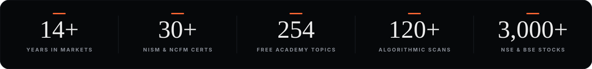
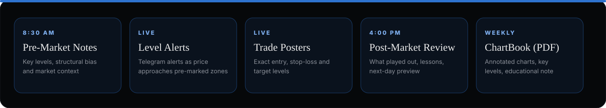
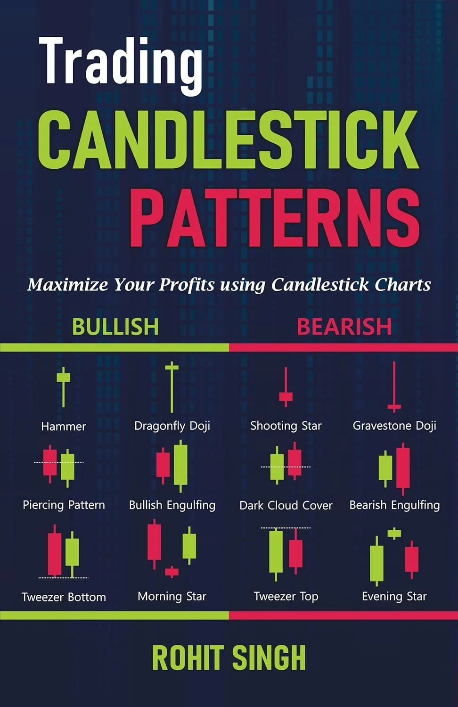
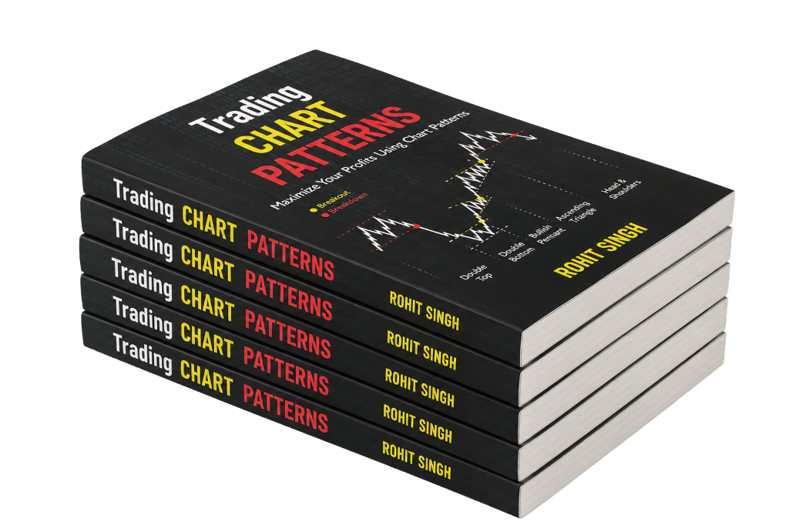

<a href="https://mrchartist.com/ecosystem"><b>Ecosystem</b></a> &nbsp;·&nbsp;
<a href="https://mrchartist.com/research"><b>Research</b></a> &nbsp;·&nbsp;
<a href="https://mrchartist.com/learn"><b>Learn</b></a> &nbsp;·&nbsp;
<a href="https://mrchartist.com/open-source"><b>Open Source</b></a> &nbsp;·&nbsp;
<a href="https://mrchartist.com/about"><b>About</b></a> &nbsp;·&nbsp;
<a href="https://investology.mrchartist.com"><b>Investology ↗</b></a>

  

 

## Hi, I am Rohit Singh

I started studying markets as a student, with no desk, no mentor and no capital. Fourteen years later, everything on [mrchartist.com](https://mrchartist.com) exists because I needed it myself and could not find it built properly anywhere else.

I am a **SEBI Registered Research Analyst (INH000015297)**, a **30+ NISM & NCFM certified** market educator, and the **Amazon #1 bestselling author** of *Trading Candlestick Patterns*.

> Charts tell you what the market is doing. Fundamentals tell you why. Discipline tells you when to act and when to sit.

| Year | Milestone |
|:---:|:---|
| **2012** | Markets journey begins: started studying and trading Indian markets |
| **2018** | Weekly ChartBook launches: chart-based setups across equity and F&O, every week |
| **2023** | The workflow becomes software: Scanner Pro, the FII/DII terminal, OptionsDesk and TradeBook |
| **2024** | SEBI registration and a first book: *Trading Candlestick Patterns* launched |
| **2025** | *Trading Candlestick Patterns* reaches **#1 on Amazon** |
| **2026** | Sector notes and ten Academy modules |

---

## Check my work

I do not ask you to trust a badge. Every setup is published with its date, its price and what would prove it wrong.

| | |
|:---|:---|
| **Look up my registration** | **INH000015297**, trading as INVESTOLOGY, registered March 2024. Verify it on SEBI's own record. |
| **Read what was written first** | The [ChartBook archive](https://mrchartist.com/research/archive) is public, including the setups that did not work. |
| **Read where my work stops** | What research is and is not, in writing: [Disclaimer](https://mrchartist.com/disclaimer). |

---

## Investology: structured chart research

**A full trading day of chart research, from the first bell to the post-market review.**

 

| Equity | F&O | Commodities |
|:---:|:---:|:---:|
| Nifty 50, BankNifty, Midcap 100 and select sectors | Index options, futures levels and expiry observations | Gold, Silver and Crude Oil: weekly structure and levels |

Investology is operated under SEBI Registration No. INH000015297. Research only, not investment advice.

---

## The ecosystem: five steps, one workflow

Every product was built because one of these steps let me down and cost me money.

| Step | Product | What it does | Status |
|:---:|:---|:---|:---:|
| Learn | **[The Academy](https://mrchartist.com/learn)** | Ten free modules. No paywall, no locked chapters. |  |
| Learn | **[Trading Books](https://mrchartist.com)** | Two price-action books on real NSE and BSE trades. |  |
| Learn | **NISM Exams** | Mock tests and notes. Free NISM guides are already in the Academy. |  |
| Research | **[Investology](https://investology.mrchartist.com)** | Structured chart research under my SEBI registration. |  |
| Research | **[Weekly ChartBook](https://mrchartist.com/research)** | Chart-based equity and F&O setups every week, with levels and invalidation marked. |  |
| Research | **[FII/DII Data](https://fii-diidata.mrchartist.com)** | FII/DII flows, F&O positioning and sector-wise FPI allocation. |  |
| Research | **[IPO Decode](https://ipodecode.mrchartist.com)** | Every mainboard and SME IPO, from DRHP to listing: GMP, subscription, allotment. |  |
| Scan | **[Scanner Pro](https://scanner.mrchartist.com)** | 120+ algorithmic scans across 3,000+ NSE and BSE stocks, with an AI market brief. |  |
| Scan | **[FundaDesk](https://funda.mrchartist.com)** | Fundamental research desk with 15+ years of statements and a Quality Score. |  |
| Trade | **[OptionsDesk](https://optionsdesk.mrchartist.com)** | Option chain across expiries, volatility research and event-based notes. |  |
| Review | **[TradeBook](https://tradebook.mrchartist.com)** | A journal for NSE, BSE and MCX trades: log why you took it, then review it. |  |

---

## The Academy: 10 modules, 254 topics, all free

<a href="https://mrchartist.com/learn/start">Start</a> ·
<a href="https://mrchartist.com/learn/technical-analysis">Technical Analysis</a> ·
<a href="https://mrchartist.com/learn/options">Options & F&O</a> ·
<a href="https://mrchartist.com/learn/fundamental">Fundamental</a> ·
<a href="https://mrchartist.com/learn/know-your-sector">Sector</a> ·
<a href="https://mrchartist.com/learn/company">Company</a> ·
<a href="https://mrchartist.com/learn/nism">NISM</a> ·
<a href="https://mrchartist.com/learn/tradingview">TradingView</a> ·
<a href="https://mrchartist.com/learn/algo">Algo</a> ·
<a href="https://mrchartist.com/learn/ai">Trading & AI</a>

---

## The books

Two price-action books, both built on real NSE and BSE trades: the entry, what proved the setup wrong, and the trades where the pattern failed. No theory-only chapters, no examples borrowed from the US market.

<table>
<tr>
<td width="50%" align="center" valign="top">

<h3>Trading Candlestick Patterns</h3>
<b>Amazon #1 bestseller</b> 
Rating 4.8 · 500+ reviews · 250+ pages · 35+ patterns  
English · Hindi · Marathi · Gujarati
</td>
<td width="50%" align="center" valign="top">

<h3>Trading Classic Chart Patterns</h3>
<b>New release</b> 
Rating 5.0 · 25+ reviews · 19 patterns · 25 case studies  
English
</td>
</tr>
<tr>
<td valign="top">

35+ patterns explained with real NSE and BSE examples. Every pattern carries entry rules, stop placement and a trade-planning frame, with Reliance, TCS and Nifty 50 cases.

</td>
<td valign="top">

Classical charting read in context: 19 chart patterns, eight decision filters, volume confirmation and 25 market case studies, with the structural traps that break a textbook pattern.

</td>
</tr>
</table>

### Trading Candlestick Patterns: all editions

| Language | Amazon | Flipkart |
|:---|:---:|:---:|
| **English** | [Buy](https://amzn.in/d/04QqZRLp) | [Buy](https://www.flipkart.com/trading-candlestick-patterns-book-maximize-your-profits-using-charts/p/itm254391ca829fe?pid=RBKH5Z8NGX2HHERJ) |
| **हिन्दी (Hindi)** | [Buy](https://www.amazon.in/dp/B0FZBW3LBW) | [Buy](https://www.flipkart.com/trading-candlestick-patterns-hindi-book-maximize-your-profits-using-charts-stock-market-technical-analysis/p/itmd4997ccac58ad) |
| **मराठी (Marathi)** | [Buy](https://www.amazon.in/dp/B0FWKKCRQP) | [Buy](https://www.flipkart.com/trading-candlestick-patterns-marathi-book-maximize-your-profits-using-charts-stock-market-technical-analysis/p/itm34e6b5e9a79b9) |
| **ગુજરાતી (Gujarati)** | [Buy](https://www.amazon.in/dp/B0F9FB7QPY) | [Buy](https://www.flipkart.com/trading-candlestick-patterns-gujarati-book-maximize-your-profits-using-charts-stock-market-technical-analysis/p/itm3a3678d3b5e82) |

### Trading Classic Chart Patterns: edition

| Language | Amazon | Flipkart |
|:---|:---:|:---:|
| **English** | [Buy](https://amzn.in/d/0bHTzPKO) | [Buy](https://www.flipkart.com/trading-chart-patterns-maximise-your-profits-using-patterns-technical-analysis-book/p/itmfec1fc7d4d370?pid=9788199128118) |

More about the candlestick book: [candlestick.mrchartist.com](https://candlestick.mrchartist.com)

---

## What is free, and what is not

| Free today | Paid, and always labelled |
|:---|:---|
| The whole Academy, nothing locked | The two books, on Amazon and Flipkart |
| The weekly ChartBook, every Sunday on Telegram | Investology research service |
| FII/DII Data and IPO Decode | |
| Scanner Pro, in open beta | |

The Academy stays free, no matter what the other tools cost.

---

## Open source

&nbsp;

&nbsp;

 

  

---

## SEBI disclosure

> [!IMPORTANT]
> **Rohit Singh** is a **SEBI Registered Research Analyst**, Registration No. **INH000015297**, trading as INVESTOLOGY.
>
> All content, code, articles, chartbooks and educational modules on [mrchartist.com](https://mrchartist.com) and associated repositories are for **educational and informational purposes only**. Investments in securities markets are subject to market risks. Read all related documents carefully before investing. Past performance is not indicative of future returns.

 

